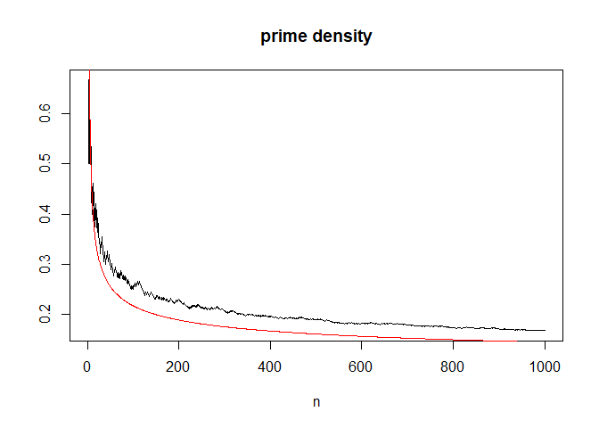

Programming with functions
================

### Functions

Functions are a fundamental building block of R.

A function is an object in R that takes some input objects (called arguments) and returns an ouput object.

A function has a form:

``` r
function_name <- function(argument_1, argument_2, ...) {
  expression_1
  expression_2
  ...
  return(output)
}
```

-   `argument_1, arguments_2` are the names of variables as inputs for the function.
-   `function_name` is the name of function. You change `function_name` as you want.

To call or run the function we type:

``` r
function_name(x1, x2, ...)
```

the value of this expression is the value of output.

-   A function may have more than one `return` statement, in which case it stops after executing the first one it reaches.
-   If there is no statement `return(output)` then the value returned by the function is the value of the last expression in the braces.

-   A function always returns a value.
-   For some functions the value returned is unimportant.
-   In such cases one usually omits the return statement, or returns NULL.
-   If the value returned by a function is not assigned to a variable, then it is printed.

-   The most important advantage of using a function is that once it is loaded, it can be used again and again without having to reload it.

-   The second most important use of functions is to break down a programming task into smaller logical units.

All work in R is done by functions. For example, we have

``` r
animals <- c("cow", "dog", "cat", "pig")
```

and you want

``` r
animals[4] <- "duck"
```

This is equivalent to

``` r
`[<-`(animals, 4, "duck")
```

    ## [1] "cow"  "dog"  "cat"  "duck"

In practice, we do not use the above expression, but it is useful to know that every operation in R is a function.

Other example:

``` r
x <- 3
y <- 4
# functional form of arithmetic expression
`+`(x,y)
```

    ## [1] 7

``` r
# functional form of if-then expression
`if`(x >y, "x is larger than y", "y is larger than x")
```

    ## [1] "y is larger than x"

#### Example : Find zeros of `a2*x^2+a1*x+a0=0`

``` r
quad3 <- function(a0, a1, a2) {
  if(a2 == 0 && a1 == 0 && a0 == 0) {
    roots <- NA 
  } else if (a2 == 0 && a1 == 0 ) {
      roots <- NULL
  } else if ( a2 == 0 ) {
    roots <- -a0/a1
  } else {
    discrim <- a1^2 - 4*a2*a0
    if (discrim > 0) {
      roots <- (-a1 +c(1,-1) * sqrt(a1^2-4*a2*a0))/(2*a2)
    } else if (discrim == 0) {
      roots <- -a1/(2*a2)
    } else {
      roots <- NULL
    }
  }
  roots
}
```

``` r
quad3(6, -5, 1)
```

    ## [1] 3 2

#### Example : n choose r

The number of ways that you can choose r things from a set of n, ignoring the order, is
  

``` r
n_factorial <-function(n) {
  n_fact <- prod(1:n)
  return(n_fact)
}
n_choose_r <- function(n, r) {
  n_ch_r <- n_factorial(n)/n_factorial(r)/n_factorial(n-r)
  return(n_ch_r)
}
```

``` r
n_choose_r(10,6)
```

    ## [1] 210

``` r
n_choose_r(10,4)
```

    ## [1] 210

#### Example : Winsorised mean

k-th Winsorised mean of x={x1, ..., xn} is defined as

  

``` r
wmean <- function(x, k) {
    x <- sort(x)
    n <- length(x)
    x[1:k] <- x[k+1]
    x[(n-k+1):n] <- x[n-k]
    mean(x)
}
```

#### Exmple : Swap

swap values of `x[1]` and `x[2]`

``` r
f1  swap <- function(x){
f2    y <- x[2]
f3    x[2] <- x[1]
f4    x[1] <- y
f5    return(x)
f6  }
p1  x <- c(7, 8, 9)
p2  x[1:2] <- swap(x[1:2])
p3  x[2:3] <- swap(x[2:3])
```

### Scope and its consequences

-   Argument and variables defined within a function exist only within that function.
-   If you define and use a variable x inside a function, it does not exist outside the function.
-   If variables with the same name exist inside and outside a function, then they are separate and do not interact at all.
-   The variable defined outside the function can be seen inside the function (provided there is not a variable with the same name defined inside).

``` r
test <- function(x) {
  y <- x+1
  return(y)
}
test(1)
```

    ## [1] 2

``` r
y
### Error : Object "y" not found
```

``` r
test2 <- function(x) {
  y <- x + z
  return(y)
}
z <- 1
test2(1)
```

    ## [1] 2

``` r
z<-2
test2(1)
```

    ## [1] 3

### Optional argument and default value

-   To give argument\_1 the default value x1 we use argument\_1 = x1 within the function definition.
-   If an argument has a default then it may be omitted when calling the function, in which case the default is used.

``` r
test3 <- function(x=1, y=1, z=1) {
  return(x*100+y*10+z)
}
test3(2,2)
```

    ## [1] 221

``` r
test3(y=2, z=2)
```

    ## [1] 122

### Vector-based programming

-   Many R functions are vectorised.
-   To further facilitate vector-based programming, R provides functions that enable the vectorisation of user-defined functions.
-   `apply`, `sapply`, `lapply`, `tapply`, and `mapply`.
-   `sapply(X, FUN)`
-   apply function `FUN` to every element of vector `X`.

#### Example : Density of primes with sapply

-   Let *ρ*(*n*) be the number of primes less than or equal to n
-   Then

  

-   To check this, first we define a function `prime` that tests if a given integer is prime.

-   We then use `sapply` to apply `prime` to the vector `2:n`.

``` r
prime <- function(n) {
  if ( n==1 ) {
    is.prime <- FALSE
  } else if ( n==2) {
    is.prime <- TRUE
  } else {
    is.prime <- TRUE
    for ( m in 2:(n/2) ) {
            if ( n%%m == 0 ) is.prime <- FALSE
    }
  }
  return(is.prime)
}   
```

``` r
n <- 1000
m.vec <- 2:n
primes <- sapply(m.vec, prime)
num.primes <- cumsum(primes)
plot(m.vec, num.primes/m.vec, type = "l", main = "prime density", xlab = "n", ylab = "")
lines(m.vec, 1/log(m.vec), col= "red")
```



### Recursive programing

-   A recursive program is one that calls itself.
-   This is useful because many algorithms are recursive in nature.

#### n factorial

``` r
nfact2 <- function(n) {
  if (n==1) {
    cat("called nfact2(1)\n")
    return(1)
  } else {
    cat("called nfact2(", n, ")\n", sep="")
    return(n*nfact2(n-1))
  }
}
```

#### Sieve of Eratosthenes

The Sieve of Eratosthenes is an algorithm for finding all of the primes less than or equal to a given number *n*.

1.  Start with the list 2, 3, ⋯, *n* and *p* = 2.
2.  Remove from the list all elements that are multiples of *p* (but keep *p* itself).
3.  Increase *p* to the smallest element of the remaining list that is larger than the current *p*.
4.  If *p* is larger than sqrt of *n* then stop, otherwise go back to step 2.

``` r
primesieve <- function(sieved, unsieved) {
  p <- unsieved[1]
  n <- unsieved[length(unsieved)]
  if ( p^2 > n ) {
    return(c(sieved, unsieved))
  } else {
    unsieved <- unsieved[unsieved %% p != 0]
    sieved <- c(sieved, p)
    return(primesieve(sieved, unsieved))
  }
}
```

### Function as an object

A function in R is just another object that is assigned to a symbol.

``` r
f <- function(x,y) c(x+1, y+2)
f(1,2)
```

    ## [1] 2 4

You can type the name of function to see the code for it.

``` r
f
```

    ## function(x,y) c(x+1, y+2)

### Anonymous function

Anonymous function is a function without a name. You use an anonymous function when it’s not worth the effort to give it a name.

``` r
(function(x) x * 10)(10)
```

    ## [1] 100

Anonymous function is `sapply`:

``` r
sapply(1:10, function(x) x^2)
```

    ##  [1]   1   4   9  16  25  36  49  64  81 100
