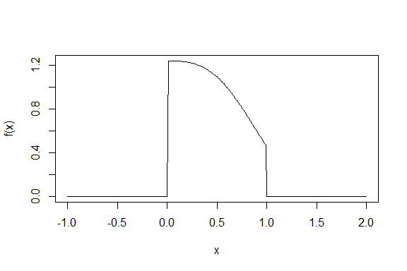
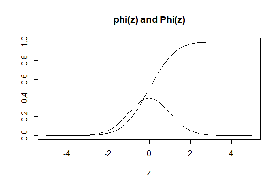

Numerical integration
================

## Introduction

-   It is frequently necessary to compute

∫<sub>*a*</sub><sup>*b*</sup>*f*(*x*)*d**x*

-   If we know the antiderivative F, then

∫<sub>*a*</sub><sup>*b*</sup>*f*(*x*)*d**x* = *F*(*b*) − *F*(*a*)

-   However for many function f, we don’t know the closed form of
    antiderivative.

-   We approximate the integral on the divided subinterval:

*a* = *x*<sub>0</sub>, *x*<sub>1</sub>, ⋯, *x*<sub>*n* − 1</sub>, *x*<sub>*n*</sub> = *b*

## Rectagular method

-   Review the rectangular method

``` r
rect <- function(ftn, a, b, n = 100){
  h <- (b-a)/n
  x.vec <- seq(a, b-h, by = h)
  f.vec <- sapply(x.vec, ftn)
  h * sum(f.vec)
}
```

``` r
ftn6 <- function(x) 4*x^3
rect(ftn6, 0, 1)
```

    ## [1] 0.9801

## Trapzoidal rule

-   Approximating the are under *y* = *f*(*x*) over the subinterval
    \[*x*<sub>*i*</sub>, *x*<sub>*i* + 1</sub>\] by a trapezoid.


-   The area of each trapezoid:

$$ \\frac{h}{2}(f(x\_i) + f(x\_{i+1})) \\textrm{ where } h = x\_{i+1} - x\_i $$

-   Trapezoidal approximation:
    $$ T = \\frac{h}{2} (f(x\_0) + 2f(x\_1) + \\cdots + 2f(x\_{n-1}) + f(x\_n))$$

``` r
trapezoid <- function(ftn, a, b, n = 100) {
  h <- (b-a)/n
  x.vec <- seq(a, b, by = h)
  f.vec <- sapply(x.vec, ftn)
  h*(f.vec[1]/2 + sum(f.vec[2:n]) + f.vec[n+1]/2)
}
```

``` r
ftn6 <- function(x) return(4*x^3)
trapezoid(ftn6, 0, 1, n=20)
```

    ## [1] 1.0025

## Simpson’s rule

-   Simpson’s rule subdivides the interval \[*a*, *b*\] into *n* (even)
    subintervals

-   and approximate *f* by a parabola (polynomial of degree 2).

$$  P(x) = f(u) \\frac{(x-v)(x-w)}{(u-v)(u-w)} + f(v) \\frac{(x-u)(x-w)}{(v-u)(v-w)} + f(w) \\frac{(x-u)(x-v)}{(w-u)(w-v)}  $$

-   As an approximation to the area, we use

$$ \\int\_v^w P(x) dx = \\frac{h}{3}(f(u) + 4f(v) + f(w)) $$


-   Now assuming *n* is even, we add up the approximation for
    subintervals \[*x*<sub>2*i*</sub>, *x*<sub>2*i* + 2</sub>\] to
    obtain Simpson’s approximations *S*.

$$ S = \\frac{h}{3}(f(x\_0) + 4f(x\_1) + 2f(x\_2) + 4f(x\_3) + 2f(x\_4) \\cdots + 2f(x\_{n-2}) + 4f(x\_{n-1}) + f(x\_n)) $$

-   Notice that the *f*(*x*<sub>*i*</sub>) for *i* odd are all weighted
    4, while the *f*(*x*<sub>*i*</sub>) for *i* even (except 0 and n)
    are weighted 2.

``` r
simpson_n <- function(ftn, a, b, n = 100) {
  n <- max(c(2*(n %/% 2), 4))
  h <- (b-a)/n
  x.vec1 <- seq(a+h, b-h, by = 2*h)
  x.vec2 <- seq(a+2*h, b-2*h, by = 2*h)
  f.vec1 <- sapply(x.vec1, ftn)
  f.vec2 <- sapply(x.vec2, ftn)
  h/3*(ftn(a) + ftn(b) + 4*sum(f.vec1) + 2*sum(f.vec2))   # return value
}
```

``` r
# or similarly
simpson_n <- function(ftn, a, b, n = 100) {
  n <- max(c(2*(n %/% 2), 4))
  h <- (b-a)/n
  
  x.vec <- seq(a, b, by = h)
  f.vec <- sapply(x.vec, ftn)
  
  h * 1/3 * (f.vec[1] + 4 * sum(f.vec[seq(2, n, by=2)]) + 2 * sum(f.vec[seq(3, n-1, by=2)]) + f.vec[n+1])
  
}
```

-   Example

``` r
ftn6 <- function(x) return(4*x^3)
simpson_n(ftn6, 0, 1, 20)
```

    ## [1] 1

#### Example : probability density function

``` r
f <- function(x) {
  if (0 < x & x < 1) 1/simpson_n(function(x) exp(-x^3), 0, 1)*exp(-x^3)
  else 0
}

plot(seq(-1,2,0.01), sapply(seq(-1,2,0.01), f), xlab="x", ylab="f(x)", 'l')
```

<!-- -->

compute the mean

``` r
(m <- simpson_n(function(x) x*f(x), 0, 1))
```

    ## [1] 0.4317834

compute the variance

``` r
simpson_n(function(x) (x-m)^2*f(x), 0, 1)
```

    ## [1] 0.0719255

How to define the cumulative distribution function *F*(*x*)?

### pdf and cdf of the standard normal

Consider the probability density function and cumulative distribution of
standard normal.

``` r
# probability density function
phi <- function(x) exp(- x ^ 2 / 2) / sqrt(2 * pi)

# cumulative distribution function
Phi <- function(z) {
  if (z < 0) 0.5 - simpson_n(phi, z, 0)
  else 0.5 + simpson_n(phi, 0, z)
}

z <- seq(-5, 5, by = 0.1)
phi.z <- sapply(z, phi)
Phi.z <- sapply(z, Phi)
plot(z, Phi.z, type = "l", ylab = "", main = "phi(z) and Phi(z)")
lines(z, phi.z)
```

<!-- -->

Why is the graph of Phi broken? How can it be fixed?

### Functional programming

Return values are determined by `f.vec`:

-   rectangular : `h * sum(f.vec)`
-   trapzoid : `h * (f.vec[1]/2 + sum(f.vec[2:n]) + f.vec[n+1]/2)`
-   Simpson :
    `h * 1/3 * (f.vec[1] + 4 * sum(f.vec[seq(2, n, by=2)]) + 2 * sum(f.vec[seq(3, n-1, by=2)]) + f.vec[n+1])`

Define each component as a function:

``` r
rect_method <- function(f.vec) sum(f.vec)

trapz_method <- function(f.vec) {
  n <- length(f.vec) - 1
  f.vec[1]/2 + sum(f.vec[2:n]) + f.vec[n+1]/2
}

simpson_method <- function(f.vec) {
  n <- length(f.vec) - 1
  (f.vec[1] +
    4 * sum(f.vec[seq(2, n, by=2)]) +
    2 * sum(f.vec[seq(3, n-1, by=2)]) +
    f.vec[n+1]) / 3
}
```

Now we can define general numerical integration function.

``` r
numerical_int <- function(ftn, a, b, n = 100, method){
  
  n <- max(c(2*(n %/% 2), 4))
  h <- (b-a)/n
  x.vec <- seq(a, b, by = h)
  f.vec <- sapply(x.vec, ftn)
  
  h * method(f.vec)
}
```

``` r
ftn6 <- function(x) return(4*x^3)
```

``` r
numerical_int(ftn6, 0, 1, method = rect_method)
```

    ## [1] 1.0201

``` r
numerical_int(ftn6, 0, 1, method = trapz_method)
```

    ## [1] 1.0001

``` r
numerical_int(ftn6, 0, 1, method = simpson_method)
```

    ## [1] 1

This programming tatic allow us to extend the numerical integrations as
a new method is implemented.

For example, the Milne method:


$$ \\int\_u^w P(x) dx = \\frac{h}{3} (4f(u) -2f(v) + 4f(w)) $$

``` r
milne_method <- function(f.vec) {
  n <- length(f.vec) - 1
  (4 * f.vec[1] +
    (-2) * sum(f.vec[seq(2, n, by=2)]) +
    8 * sum(f.vec[seq(3, n-1, by=2)]) +
    4 * f.vec[n+1]) * 1 / 3
}
```

``` r
numerical_int(ftn6, 0, 1, method = milne_method)
```

    ## [1] 1.0006

More about functional programming :
<http://adv-r.had.co.nz/Functional-programming.html>
