Discrete random variable
================

Discrete random variable in R
-----------------------------

R has built-in functions for handling the most commonly encountered probability distributions.
Let *X* be of type `dist` with parameters `p1`, `p2`, ..., then

-   `ddist(x, p1, p2, ...)` equals *P*(*X* = *x*) for *X* discrete, or the density of *X* at *x* for *X* continuous.

-   `pdist(q, p1, p2, ...)` equals *P*(*X* ≤ *q*)

-   `qdist(p, p1, p2, ...)` equals the smallest *q* for which *P*(*X* ≤ *q*)≥*p* (the 100*p*%-point)

-   `rdist(x, p1, p2, ...)` is a vector of n pseudo-random numbers from distribution type dist.

The input `x`, `p`, `q` can all be vector valued, in which case the output is vector valued.

Some of the discrete distributions
----------------------------------

Some of the discrete distributions provided by R, together with the names of their parameter inputs.

| Distribution      | R name (dist) | Paramter names |
|-------------------|---------------|----------------|
| Binomial          | `binom`       | `size, prob`   |
| Geometric         | `geom`        | `prob`         |
| Negative binomial | `nbinom`      | `size, prob`   |
| Poisson           | `pois`        | `lambda`       |

*P*(*X* ≤ 5) for *X* which follows binomial distribution with `size=10`, `prob =0.5`.

``` r
pbinom(5, 10, 0.5)
```

    ## [1] 0.6230469

Bernoulli distribution
----------------------

A Bernoulli random variable *B* is based on a single trial

-   takes on the value 1 if the trial is a success

-   0 otherwise.

We use notation *B* ~ *B**e**r**n**o**u**l**l**i*(*p*).

-   *P*(*B* = *x*)=*p* for *x* = 1 and *P*(*B* = *x*)=1 − *p* for *x* = 0.

-   *E*\[*B*\]=*p*.

-   *V**a**r*(*B*)=*p*(1 − *p*).

Binomial distribution
---------------------

Let *X* be the number of success in n independent trials, with probability of success *p*.

Then *X* is said to have a binomial distribution with parameters *n* and *p*.

Let *B*<sub>1</sub>, ..., *B*<sub>*n*</sub> be independent *B**e**r**n**o**u**l**l**i*(*p*) r.v.s, then

-   *X* = *B*<sub>1</sub> + ... + *B*<sub>*n*</sub> ~ *b**i**n**o**m*(*n*, *p*)

For *x* = 0, 1, ..., *n*, we have

The Bernoulli distribution is the same as a *b**i**n**o**m*(1, *p*).

### Related functions in R

[R online document for Binomial](https://www.rdocumentation.org/packages/stats/versions/3.4.0/topics/Binomial)

#### probability mass function for the binomial such that *P*(*X* = *x*)

##### Usage

``` r
dbinom(x, size, prob, log=FALSE)
```

-   `x` can be a vector

##### Example

``` r
dbinom(c(0,1,2,3,4,5), size=5, prob=0.4)
```

    ## [1] 0.07776 0.25920 0.34560 0.23040 0.07680 0.01024

#### probability distribution function for the binomial such that *P*(*X* ≤ *q*)

##### Usage

``` r
pbinom(q, size, prob, lower.tail = TRUE, log.p = FALSE)
```

-   `q` can be a vector

##### Example

``` r
pbinom(c(0,1,2,3,4,5), 5, 0.4)
```

    ## [1] 0.07776 0.33696 0.68256 0.91296 0.98976 1.00000

#### quantile function

##### Usage

``` r
qbinom(p, size, prob, lower.tail = TRUE, log.p = FALSE)
```

#### random number generator

##### Usage

``` r
rbinom(n, size, prob)
```

-   `n` observations of of the binomial random variable

    -   `size` : number of trial
    -   `prob` : probability of success on each trial

##### Example

``` r
rbinom(5, size = 10, prob = 0.4)
```

    ## [1] 5 4 4 2 3

### Binomial probability mass function

With different paramter settings, observe the probability mass functions.

``` r
par(mfrow=c(2, 2))
x <- seq(0, 20, 1)

ps <- c(0.5, 0.5, 0.2, 0.8)
trials <- c(10, 20, 10, 10)

for (i in seq(1,4)){
   y <- dbinom(x, trials[i], ps[i])
   plot(x,y,xlim=c(0, trials[i]), ylim=c(0,1), xlab="x", ylab="P(X=x)", type="h")
   points(x, y)
   title(paste0("binomial(", trials[i], "," , ps[i], ")"))
}
```


### Binomial probability distribution function

``` r
par(mfrow=c(2, 2))
x <- seq(0, 20, 1)

ps <- c(0.5, 0.5, 0.2, 0.8)
trials <- c(10, 20, 10, 10)

for (i in seq(1,4)){
   y <- pbinom(x, trials[i], ps[i])
   plot(x, y, xlim=c(0, trials[i]), ylim=c(0,1), xlab="x",
                           ylab="P(X<=x)", type="s")
   title( paste("binomial(", trials[i], ",", ps[i], ")") )
}
```


### Generate random variables

-   Generates *N* binomial random variables using `rbinom`.

``` r
N <- 100; n <- 20; p <- 0.4
(brv <- rbinom(N, n, p) )
```

    ##   [1]  4  8  8 10  8 11  4  9  6  7  8  5 10 11  8  8 12  5  7  7  7  8  9
    ##  [24]  7  4  3  7  6 14 12 11  7  7 11  9 12 13  9  7  5  8  8  8 10  9  7
    ##  [47] 12  9 10 10  8  3  4  5  7  9  9  6  9  6  9 10 11 10  7  4 10  9  4
    ##  [70] 11  5 11  7  8 11  6  8 13  6  2 11  5  9  9  9  8  9  7  7  8  4  3
    ##  [93] 11  9  3 11  9  6  5  9

-   `table` counts the number of values for each observation.

``` r
table(brv)
```

    ## brv
    ##  2  3  4  5  6  7  8  9 10 11 12 13 14 
    ##  1  4  7  7  7 15 15 18  8 11  4  2  1

-   Using `factor`, you can specify `levels`.

``` r
table(factor(brv, levels=0:20))
```

    ## 
    ##  0  1  2  3  4  5  6  7  8  9 10 11 12 13 14 15 16 17 18 19 20 
    ##  0  0  1  4  7  7  7 15 15 18  8 11  4  2  1  0  0  0  0  0  0

### Comparison between r.v. and pmf

-   If *N* is large, then the relative frequency of the random variables is similar to the pmf.

``` r
N <- 500; n <- 20; p <- 0.4

frequency <- table(factor(rbinom(N, n, p), levels = 0:n))
relative_frequency <- as.numeric(frequency/N)


x <- 0:n
pmf <- dbinom(x, n, p)

par(mfrow=c(1,2))
plot(x, relative_frequency, 'h')
plot(x, pmf, 'h')
```

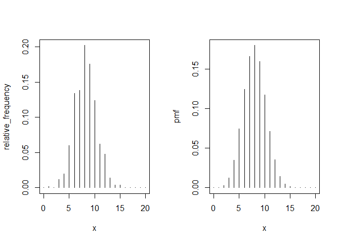

#### Example

-   What is the probability that a thousand randomly selected items will have less than 20 failures?

``` r
pbinom(19, size=1000, prob=0.01)
```

    ## [1] 0.9967116

Geometric distribution
----------------------

-   Let *B*<sub>1</sub>, *B*<sub>2</sub>, ... be an infinite sequence of independent *B**e**r**n**o**u**l**l**i*(*p*) random variables

-   and let *Y* be such that *B*<sub>1</sub> = ... = *B*<sub>*Y*</sub> = 0 and *B*<sub>*Y* + 1</sub> = 1

-   Then *Y* is said to have a geometric distribution with parameter *p*.

-   *Y* is the number of trials up to (but not including) the first success.

-   We write *Y* ~ geom(*p*), and we have,

    -   *P*(*Y* = *y*)=*p*(1 − *p*)<sup>*y*</sup>
    -   *E*\[*Y*\]=(1 − *p*)/*p*
    -   *V**a**r*(*Y*)=(1 − *p*)/*p*<sup>2</sup>

### pmf of geometric distribution

``` r
par(mfrow=c(2,2))
x <- seq(0,20,1)
ps <- seq(0.2,0.8,0.2)
for (p in ps){
    y <- dgeom(x, p)
    plot(x,y,xlim=c(0,20),ylim=c(0,1),xlab="x",     ylab="P(X=x)",type="h")
    points(x,y)
    title(paste("geometric(",p,")"))
}
```

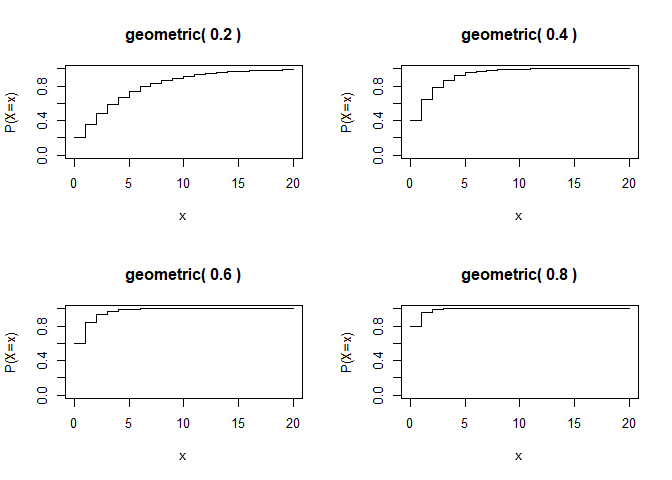

### cdf of geometric distribution

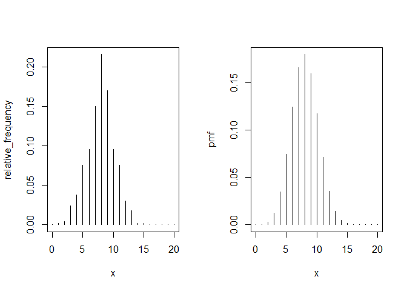


### Comparison with simulation

``` r
N <- 500; p <- 0.4; xmax <- 20

x <- 0:xmax
pmf <- dgeom(x, p)

frequency <- table(factor(rgeom(N, p), levels=x))
relative_frequency <- as.numeric(frequency/N)

par(mfrow=c(1,2))
plot(x, relative_frequency, 'h')
plot(x, pmf, 'h')
```

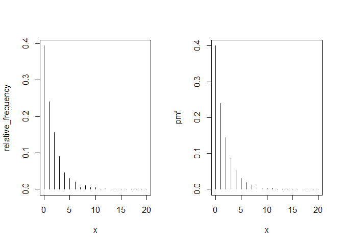

### Comparison with simulated trials

``` r
N <- 500; p <- 0.4; xmax <- 20;

geom_rv = numeric(N)
for (i in 1:N){
  n <- 0
    while(TRUE){
      trial <- rbinom(1, 1, 0.4)
      if (trial == 1) break
      n <- n+1
  }
  geom_rv[i] <- n
}

x <- 0:xmax
pmf <- dgeom(x, p)

frequency <- table(factor(rbinom(N, n, p), levels = x))
relative_frequency <- as.numeric(frequency/N)

par(mfrow=c(1,2))
plot(x, relative_frequency, 'h');   plot(x, pmf, 'h')
```

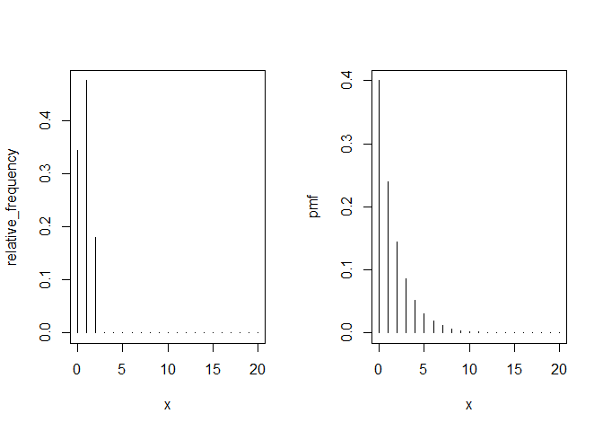

Negative binomial distribution
------------------------------

-   Let *Z* be the number of failures before the *r*-th success, in a sequence of iid *B**e**r**n**o**u**l**l**i*(*p*) trials.

-   Then *Z* is said to have a negative binomial distribution and we write *Z* ∼ *n**b**i**n**o**m**i**a**l*(*r*, *p*).

-   Let *Y*<sub>1</sub>, ..., *Y*<sub>*r*</sub> be i.i.d. geom(*p*) r.v.s, then
    -   *Z* = *Y*<sub>1</sub> + ... + *Y*<sub>*r*</sub> ~ nbinom(*r*, *p*)
-   It follows
    -   *E*\[*Z*\]=*r*(1 − *p*)/*p*
    -   *V**a**r*(*X*)=*r*(1 − *p*)/*p*<sup>2</sup>

### Negative binomial probability mass function

``` r
par(mfrow=c(2,2))
x <- seq(0,20,1)
sizes = c(2, 3, 10, 10)
probs = c(0.5, 0.5, 0.5, 0.8)

for (i in seq(1,4)){
  y<- dnbinom(x, sizes[i], probs[i])
    plot(x, y, xlim=c(0,20), ylim=c(0,1), xlab="x", ylab="P(X=x)", type="h")
    points(x, y)
    title(paste("neg-binomial(", sizes[i], ",", probs[i], ")"))
}
```

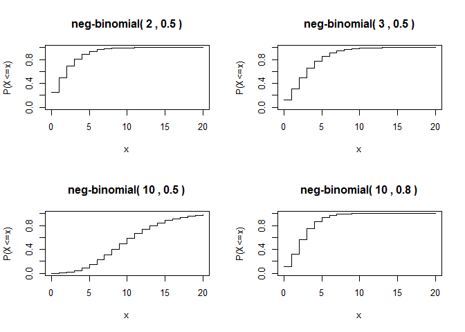

### Negative binomial distribution function

``` r
par(mfrow=c(2,2))
x <- seq(0,20,1)
sizes = c(2, 3, 10, 10)
probs = c(0.5, 0.5, 0.5, 0.8)

for (i in seq(1,4)){
  y<- pnbinom(x, sizes[i], probs[i])
    plot(x, y, xlim=c(0,20), ylim=c(0,1), xlab="x", ylab="P(X<=x)", type="s")
    title(paste("neg-binomial(", sizes[i], ",", probs[i], ")"))
}
```

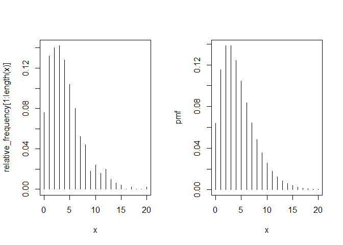

### Comparison with simulated trials

``` r
N <- 500; r <- 3; p <- 0.4; xmax <- 20;
nbinom_rv = numeric(N)
for (i in 1:N){
  total_trial <- 0
  total_success <- 0 
  while(TRUE){
    total_success <- total_success + rbinom(1, 1, p)
    total_trial <- total_trial + 1
    if (total_success == r) break
  }
  nbinom_rv[i] <- total_trial - total_success
}

x <- 0:xmax;   pmf <- dnbinom(x, r, p)
relative_frequency <- as.numeric(table(factor(nbinom_rv, levels=x))/N)

par(mfrow=c(1,2))
plot(x, relative_frequency, 'h')
plot(x, pmf, 'h')
```

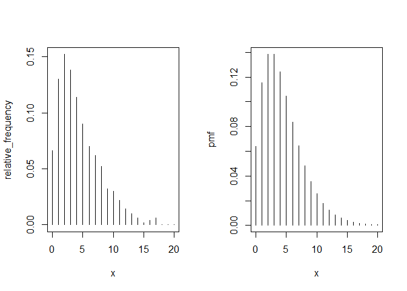

### Example: quality control

-   A manufacturer tests the production quality of its product by randomly selecting 100 from each batch.

-   If there are more than two faulty items, then they stop the production.

-   The probability of fault : *p*

-   Check the probability of stopping when we check 100 items.

-   Let *Z* be the number of items we check before we find three faults, then *Z* ∼ *n**b**i**n**o**m**i**a**l*(3, *p*) and
    -   *P*(stopping production) = *P*(*Z* + 3 ≤ 100)

``` r
pnbinom(97, 3, 0.01)
```

    ## [1] 0.0793732

This value also can be represented by the binomial distribution:

-   The probability of three or more faulty items from 100 items.

``` r
1-pbinom(2, 100, 0.01)
```

    ## [1] 0.0793732

Poisson distribution
--------------------

The Poisson distribution is used as a model for events occurring at random over time or space.

-   number of accidents in a year

-   number of misprints on a page

-   number of gamma particles released in a second

-   number of phone calls at an exchange in an hour

-   number of companies going bankrupt in a year

We say *X* has a Poisson distribution with parameter *λ*, and write *X*∼ pois(*λ*).

-   *E*\[*X*\]=*λ*

-   *V**a**r*(*X*)=*λ*

### Poisson distribution in R

``` r
dpois(x, lambda, log = FALSE)
```

-   probability mass function for the Poisson such that *P*(*X* = *x*)
    -   `x` can be a vector
-   `lambda` : (non-negative) mean, can be a vector

``` r
ppois(q, lambda, lower.tail = TRUE, log.p = FALSE)
```

-   Poisson distribution function such that *P*(*X* ≤ *q*)

``` r
qpois(p, lambda, lower.tail = TRUE, log.p = FALSE)
```

-   quantile function

``` r
rpois(n, lambda)
```

-   random generation for the Poisson distribution

### Poisson probability mass function

``` r
par(mfrow=c(2, 2))
x <- seq(0, 20, 1)
lambdas = c(0.1, 1, 5, 10)

for (lambda in lambdas){
    y <- dpois(x, lambda)
    plot(x,y,xlim=c(0,20), ylim=c(0,1), xlab="x", ylab="P(X=x)", type="h")
    points(x, y)
    title(paste("Poisson(", lambda, ")"))
}
```

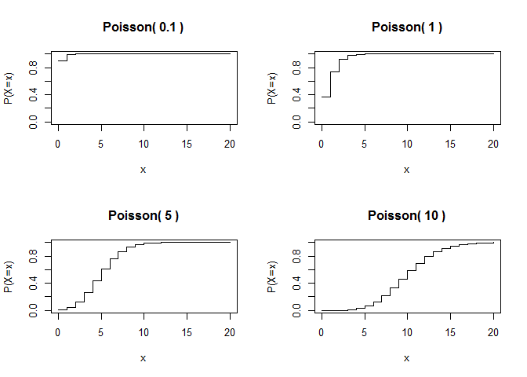

### Poisson probability distribution function

``` r
par(mfrow=c(2, 2))
x <- seq(0, 20, 1)
lambdas = c(0.1, 1, 5, 10)

for (lambda in lambdas){
    y <- ppois(x, lambda)
    plot(x,y,xlim=c(0,20), ylim=c(0,1), xlab="x", ylab="P(X=x)", type="s")
    title(paste("Poisson(", lambda, ")"))
}
```

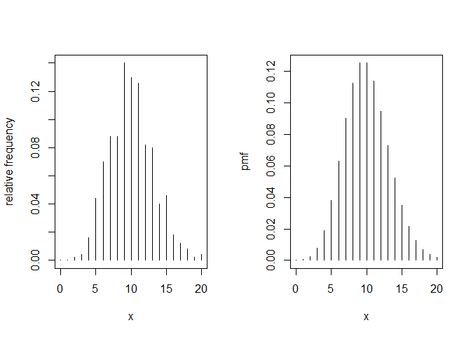

### Comparison with simulation

``` r
N <- 500; lambda <- 10; xmax <- 20

x <- 0:xmax
pmf <- dpois(x, lambda)

frequency <- table(factor(rpois(N, lambda), levels=x))
relative_frequency <- as.numeric(frequency/N)

par(mfrow=c(1,2))
plot(x, relative_frequency, ylab = "relative frequency", 'h')
plot(x, pmf, 'h')
```

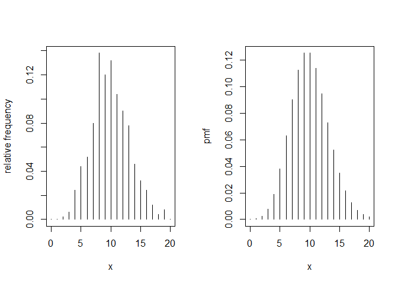

### Poisson approximation to binomial

When *n* is large and *p* is small, *b**i**n**o**m*(*n*, *p*) is approximated by *p**o**i**s*(*n**p*).

``` r
n <- 200; p <- 0.03; x<-0:20
par(mfrow=c(1,2))
plot(x, dbinom(x, n, p), 'h')
plot(x, dpois(x, n*p), 'h')
```


