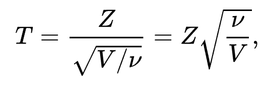

## Uncorrelated but dependent variables

Indepnent variables are uncorrelated but uncorrelated variables can be dependent.


```{r}
n <- 10000
X <- runif(n, -1, 1)
Z <- runif(n, -1, 1)
Y <- sign(Z)*abs(X)
cor(X,Y)   # correlation coefficient is almost 0
```
```{r, fig.height=5, fig.width=5}
plot(X,Y, cex=0.1) # check scatter plot
```

## Inversion method

### Generate normal distribution from uniform random variables


Using inverse normal cdf, we can simple generate a normal distribution from uniform distribution.

* In R, we use ```qnorm``` function.

* This may not be efficient but easy to understand.


```{r}
n <- 10000
my_norm_rv <- qnorm(runif(n))

# plot histogram and normal pdf
hist(my_norm_rv, breaks = seq(-5,5,0.2), freq=F)
x <- seq(-5,5,0.1)
lines(x, dnorm(x))
```

QQ-plot

```{r}
qqnorm(my_norm_rv)
```


### Generate exponential distribution from uniform random variables

```{r}
Nsim <- 10000       #number of random variables
U <- runif(Nsim)
X <- -log(U)        #transforms of uniforms
Y <- rexp(Nsim)     #exponentials from R
par(mfrow=c(1,2))   #plots
hist(X,freq=F,main="Exp from Uniform")
hist(Y,freq=F,main="Exp from R")
```


## Box-Muller algorithm to generate normal

Generate two normals from two uniforms.

In the following, ```X1``` and ```X2``` follows independent normal distributions.

```{r}
Nsim <- 10000
U1 <- runif(Nsim)   #uniform1
U2 <- runif(Nsim)   #uniform2
X1 <- sqrt(-2*log(U1))*cos(2*pi*U2)
X2 <- sqrt(-2*log(U1))*sin(2*pi*U2)

par(mfrow=c(1,2))
x <- seq(-5,5,0.1)
hist(X1, breaks = seq(-5,5,0.2), freq=F)
lines(x, dnorm(x), col='red')

hist(X2, breaks = seq(-5,5,0.2), freq=F)
lines(x, dnorm(x), col='red')
```

## Rejection method

Suppose that pdf $f$ is non-zero only on $[a,b]$ and $f<k$.

* Generate $X \sim U(a,b)$ and $Y \sim U(0,k)$ independet of $X$

* If $Y < f(X)$ then return $X$, otherwise go back to the previous step.

### Example
Suppose that pdf $f$ is a $\sin$ function.

$$f(x) = 0.5*sin(x),  x \in [0,\pi]$$
```{r}
NSim <- 10000
X <- runif(NSim, 0, pi)
Y <- runif(NSim)
Z <- X[0.5*sin(X) > Y ]
hist(Z, breaks = 40, freq=F)
x <- seq(0, pi, 0.001)
y <- 0.5*sin(x)
lines(x, y, col='red')

```


## Memoryless property

The exponential distribution has a memoryless property.

Let X follows an exponential distribution.

The following simulates P(X>4).

```{r}
n <- 1000000
y <- rexp(n, rate = 0.1)
larger_4 <- y[y > 4]
(ratio1 <- length(larger_4)/n)
```

The following simulates P( X>12 | X>8 ) which is similar to the previous result.

```{r}
larger_8 <- y[y > 8]
larger_12 <- y[y > 12]

(ratio2 <- length(larger_12)/length(larger_8))

```

## Generating t distribution from normal distributions

* Student t random variable with d.f. $\nu$ can be reperesented by

     

where

* $Z$ is a standard normal r.v.
* $V$ is a chi-square r.v. with d.f. $\nu$
* $Z$ and $V$ are independent

```{r}
Nsim <- 10000
nu <- 10
Z <- rnorm(Nsim)
V <- rnorm(Nsim)^2
for (i in 2:nu) V <- V+rnorm(Nsim)^2
Trv <- Z * sqrt(nu/V)

Y <- rt(Nsim, df=nu)     #t random variable from R
par(mfrow=c(1,2))   #plots
hist(Trv, breaks = seq(-10,10,0.2), freq=F, main="T from normal")
hist(Y, breaks = seq(-10,10,0.2), freq=F, main="T from R")
```


## t statistics

```{r}
mu <- 5
sigma <- 3
n <- 7     # sample size
N <- 10000   # simulation number
t_statistic <- numeric(N)

for (i in 1:N){
  sample_data <- rnorm(n, mu, sigma)
  t_statistic[i] <- (mean(sample_data) - mu)/(sd(sample_data)/sqrt(n))
}

hist(t_statistic, breaks = seq(min(t_statistic),max(t_statistic)+0.2,0.2), probability=T)

x <- seq(-6,6,0.01)
lines(x, dt(x, n-1))
```

QQ plot

```{r}
qqnorm(t_statistic)
```


## Random walk

### One-dimensional random walk
A basic example of a random walk is the random walk on the integer, which start at 0 and at each step moves +1 or -1 with equal probability.

```{r}
n <- 100              # number of random walk
walk <- rbinom(n, size = 1, prob = 0.5)     # generate bernoulli random number
walk[walk == 0] <- -1               # change 0 as -1
random_walk <- c(0, cumsum(walk))   # cumulative sum of walk is random walk, starting at zero
plot(random_walk, type='s')
```

### Random walk with unequal probablity


Simpliy change ```prob``` in the above code.

```{r}
n <- 100              # number of random walk
walk <- rbinom(n, size = 1, prob = 0.6)     # generate bernoulli random number
walk[walk == 0] <- -1               # change 0 as -1
random_walk <- c(0, cumsum(walk))   # cumulative sum of walk is random walk, starting at zero
plot(random_walk, type='s')         # upward random walk
```

## Brownian motion

In the above example, each movement is simpy +1 or -1.

If the movement follows a normal distribution, the process is an approximation of a Brownian motion.

```{r}
n <- 1000              # number of random walk
walk <- rnorm(n, mean = 0, sd = 1)     # generate normal random number
Brownian_motion <- c(0, cumsum(walk))   # cumulative sum of walk is random walk, starting at zero
plot(Brownian_motion, type='l')
```

You can modify the time index in the graph.
```{r}
time_index <- seq(0,n*0.01,0.01)
plot(time_index, Brownian_motion, type='l')
```


You can change the ```mean``` or ```sd``` of the normal distribution.

With ```sd = 0.01```.
```{r}
n <- 1000              # number of random walk
walk <- rnorm(n, mean = 0, sd = 0.01)     # generate normal random number
Brownian_motion <- c(0, cumsum(walk))   # cumulative sum of walk is random walk, starting at zero
plot(Brownian_motion, type='l')
```

With ```mean = 0.1```.

```{r}
n <- 1000              # number of random walk
walk <- rnorm(n, mean = 0.1, sd = 1)     # generate normal random number
Brownian_motion <- c(0, cumsum(walk))   # cumulative sum of walk is random walk, starting at zero
plot(Brownian_motion, type='l')
```

## Geometric Brownian motion

The exponential version of a Brownian motion, a geometric Brownian motion, is widely used in modeling finanical asset price.

* The following implements the simplified version of a geometric Brownian motion.

* Consider it as a stock price movement starting at 1.

```{r}
n <- 1000              # number of random walk
walk <- rnorm(n, mean = 0, sd = 0.01)     # generate normal random number
Brownian_motion <- c(0, cumsum(walk))   # cumulative sum of walk is random walk, starting at zero
GBM <- exp(Brownian_motion)
plot(GBM, type='l')
```


