More on simulation
================

Uncorrelated but dependent variables
------------------------------------

Indepnent variables are uncorrelated but uncorrelated variables can be dependent.

``` r
n <- 10000
X <- runif(n, -1, 1)
Z <- runif(n, -1, 1)
Y <- sign(Z)*abs(X)
cor(X,Y)   # correlation coefficient is almost 0
```

    ## [1] -0.01698002

``` r
plot(X,Y, cex=0.1) # check scatter plot
```

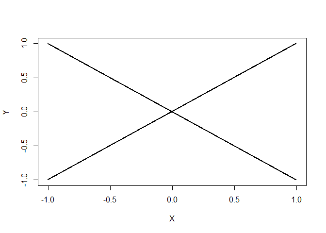

Generate normal distribution from uniform random variables
----------------------------------------------------------

Using inverse normal cdf, we can simple generate a normal distribution from uniform distribution.

-   In R, we use `qnorm` function.

-   This may not be efficient but easy to understand.

``` r
n <- 10000
my_norm_rv <- qnorm(runif(n))

# plot histogram and normal pdf
hist(my_norm_rv, breaks = seq(-5,5,0.2), freq=F)
x <- seq(-5,5,0.1)
lines(x, dnorm(x))
```

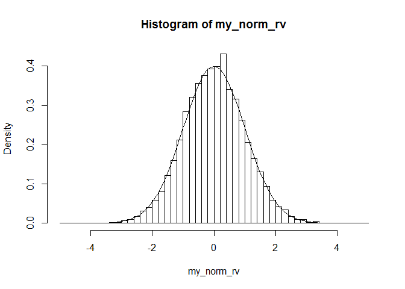

QQ-plot

``` r
qqnorm(my_norm_rv)
```

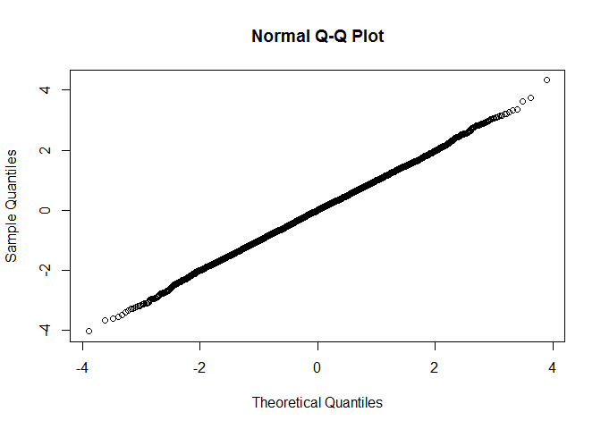

Generate exponential distribution from uniform random variables
---------------------------------------------------------------

``` r
Nsim <- 10000       #number of random variables
U <- runif(Nsim)
X <- -log(U)        #transforms of uniforms
Y <- rexp(Nsim)     #exponentials from R
par(mfrow=c(1,2))   #plots
hist(X,freq=F,main="Exp from Uniform")
hist(Y,freq=F,main="Exp from R")
```

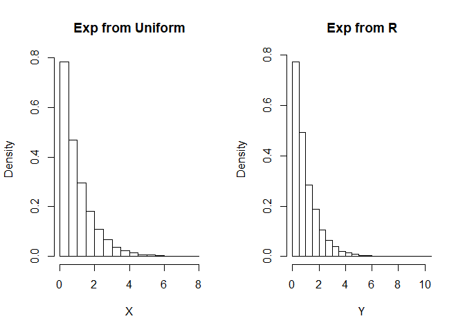

Memoryless property
-------------------

The exponential distribution has a memoryless property.

Let X follows an exponential distribution.

The following simulates P(X&gt;6).

``` r
n <- 1000000
y <- rexp(n, rate = 0.1)
larger_4 <- y[y > 4]
(ratio1 <- length(larger_4)/n)
```

    ## [1] 0.670155

The following simulates P( X&gt;16 | X&gt;10 ) which is similar to the previous result.

``` r
larger_8 <- y[y > 8]
larger_12 <- y[y > 12]

(ratio2 <- length(larger_12)/length(larger_8))
```

    ## [1] 0.6712732

t statistics
------------

``` r
mu <- 5
sigma <- 3
n <- 7     # sample size
N <- 10000   # simulation number
t_statistic <- numeric(N)

for (i in 1:N){
  sample_data <- rnorm(n, mu, sigma)
  t_statistic[i] <- (mean(sample_data) - mu)/(sd(sample_data)/sqrt(n))
}

hist(t_statistic, breaks = seq(min(t_statistic),max(t_statistic)+0.2,0.2), probability=T)

x <- seq(-6,6,0.01)
lines(x, dt(x, n-1))
```

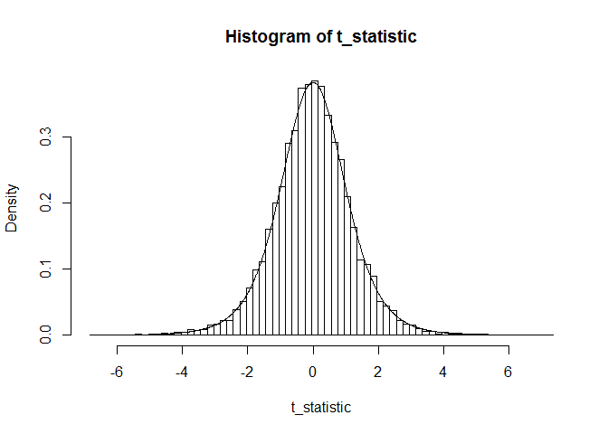

QQ plot

``` r
qqnorm(t_statistic)
```

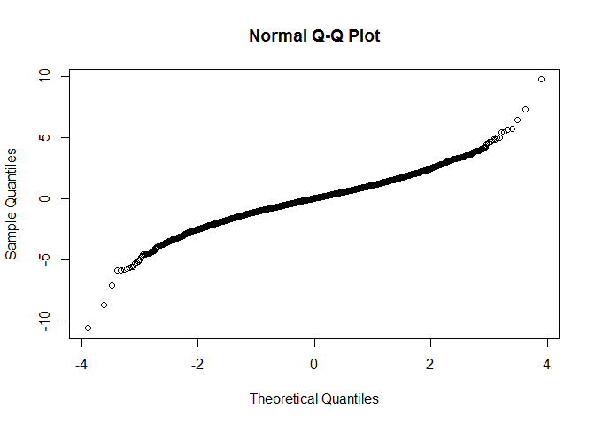

Random walk
-----------

### One-dimensional random walk

A basic example of a random walk is the random walk on the integer, which start at 0 and at each step moves +1 or -1 with equal probability.

``` r
n <- 100              # number of random walk
walk <- rbinom(n, size = 1, prob = 0.5)     # generate bernoulli random number
walk[walk == 0] <- -1               # change 0 as -1
random_walk <- c(0, cumsum(walk))   # cumulative sum of walk is random walk, starting at zero
plot(random_walk, type='s')
```

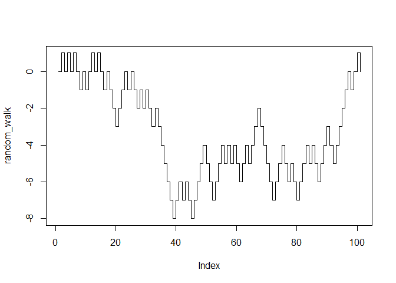

### Random walk with unequal probablity

Simpliy change `prob` in the above code.

``` r
n <- 100              # number of random walk
walk <- rbinom(n, size = 1, prob = 0.6)     # generate bernoulli random number
walk[walk == 0] <- -1               # change 0 as -1
random_walk <- c(0, cumsum(walk))   # cumulative sum of walk is random walk, starting at zero
plot(random_walk, type='s')         # upward random walk
```

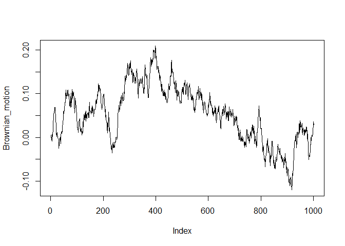

Brownian motion
---------------

In the above example, each movement is simpy +1 or -1.

If the movement follows a normal distribution, the process is an approximation of a Brownian motion.

``` r
n <- 1000              # number of random walk
walk <- rnorm(n, mean = 0, sd = 1)     # generate normal random number
Brownian_motion <- c(0, cumsum(walk))   # cumulative sum of walk is random walk, starting at zero
plot(Brownian_motion, type='l')
```

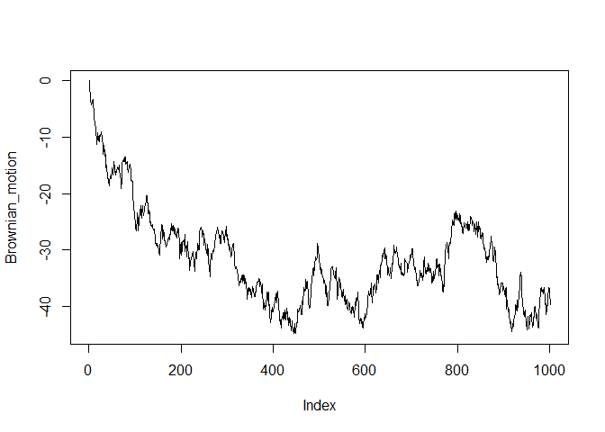

You can modify the time index in the graph.

``` r
time_index <- seq(0,n*0.01,0.01)
plot(time_index, Brownian_motion, type='l')
```

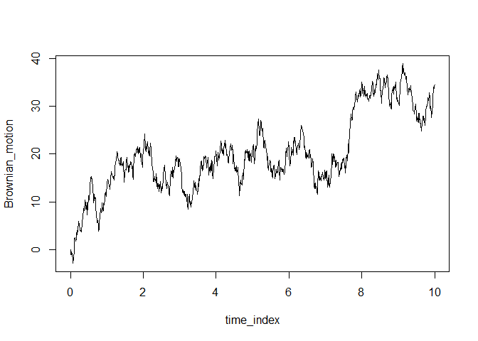

You can change the `mean` or `sd` of the normal distribution.

With `sd = 0.01`.

``` r
n <- 1000              # number of random walk
walk <- rnorm(n, mean = 0, sd = 0.01)     # generate normal random number
Brownian_motion <- c(0, cumsum(walk))   # cumulative sum of walk is random walk, starting at zero
plot(Brownian_motion, type='l')
```

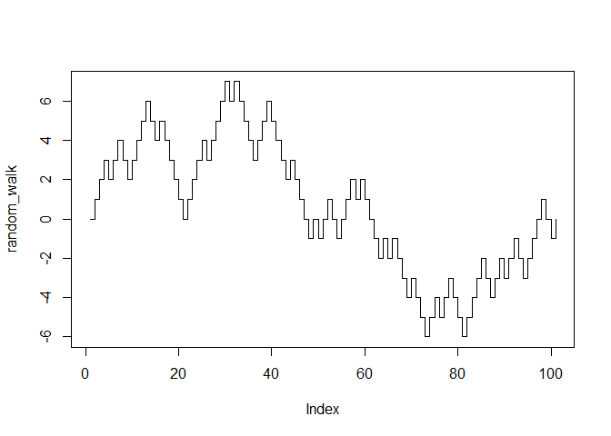

With `mean = 0.1`.

``` r
n <- 1000              # number of random walk
walk <- rnorm(n, mean = 0.1, sd = 1)     # generate normal random number
Brownian_motion <- c(0, cumsum(walk))   # cumulative sum of walk is random walk, starting at zero
plot(Brownian_motion, type='l')
```

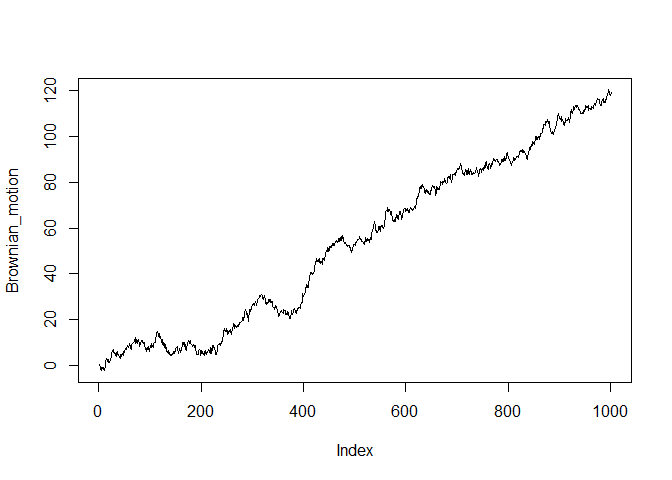

Geometric Brownian motion
-------------------------

The exponential version of a Brownian motion, a geometric Brownian motion, is widely used in modeling finanical asset price.

-   The following implements the simplified version of a geometric Brownian motion.

-   Consider it as a stock price movement starting at 1.

``` r
n <- 1000              # number of random walk
walk <- rnorm(n, mean = 0, sd = 0.01)     # generate normal random number
Brownian_motion <- c(0, cumsum(walk))   # cumulative sum of walk is random walk, starting at zero
GBM <- exp(Brownian_motion)
plot(GBM, type='l')
```

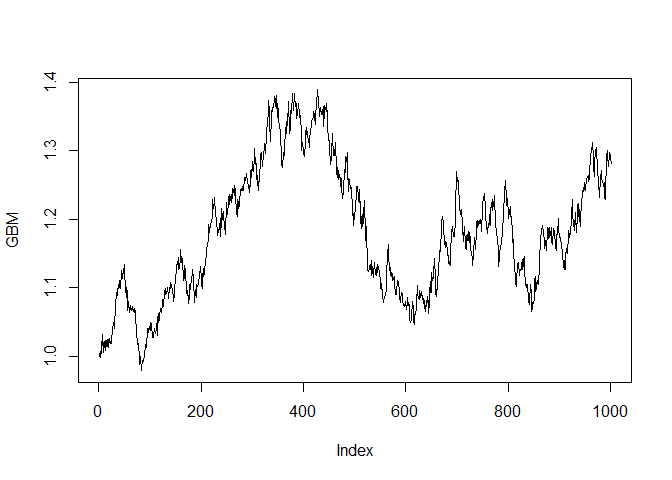

Random walk
-----------

### One-dimensional random walk

A basic example of a random walk is the random walk on the integer, which start at 0 and at each step moves +1 or -1 with equal probability.

``` r
n <- 100              # number of random walk
walk <- rbinom(n, size = 1, prob = 0.5)     # generate bernoulli random number
walk[walk == 0] <- -1               # change 0 as -1
random_walk <- c(0, cumsum(walk))   # cumulative sum of walk is random walk, starting at zero
plot(random_walk, type='s')
```

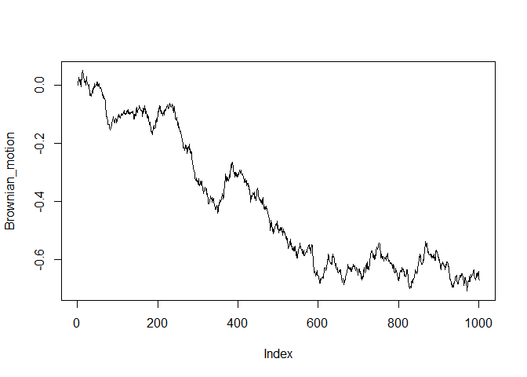

### Random walk with unequal probablity

Simpliy change `prob` in the above code.

``` r
n <- 100              # number of random walk
walk <- rbinom(n, size = 1, prob = 0.6)     # generate bernoulli random number
walk[walk == 0] <- -1               # change 0 as -1
random_walk <- c(0, cumsum(walk))   # cumulative sum of walk is random walk, starting at zero
plot(random_walk, type='s')         # upward random walk
```

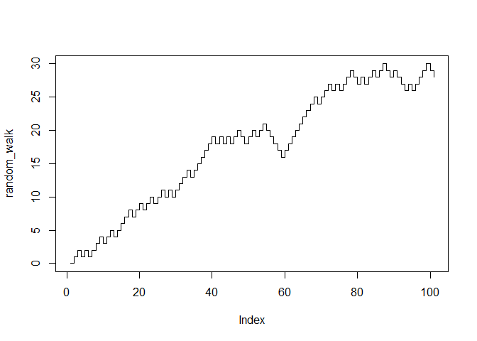

Brownian motion
---------------

In the above example, each movement is simpy +1 or -1.

If the movement follows a normal distribution, the process is an approximation of a Brownian motion.

``` r
n <- 1000              # number of random walk
walk <- rnorm(n, mean = 0, sd = 1)     # generate normal random number
Brownian_motion <- c(0, cumsum(walk))   # cumulative sum of walk is random walk, starting at zero
plot(Brownian_motion, type='l')
```

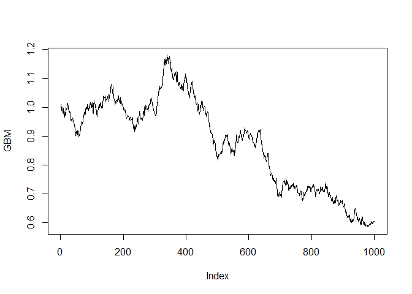

You can modify the time index in the graph.

``` r
time_index <- seq(0,n*0.01,0.01)
plot(time_index, Brownian_motion, type='l')
```

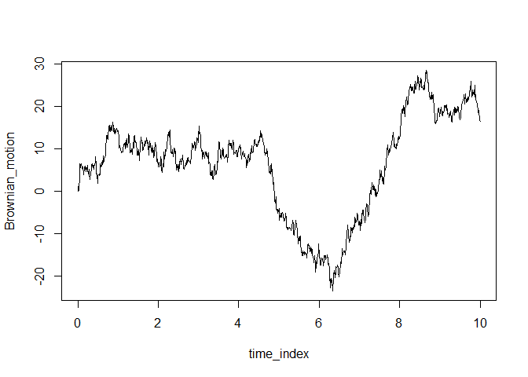

You can change the `mean` or `sd` of the normal distribution.

With `sd = 0.01`.

``` r
n <- 1000              # number of random walk
walk <- rnorm(n, mean = 0, sd = 0.01)     # generate normal random number
Brownian_motion <- c(0, cumsum(walk))   # cumulative sum of walk is random walk, starting at zero
plot(Brownian_motion, type='l')
```

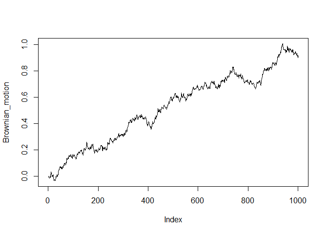

With `mean = 0.1`.

``` r
n <- 1000              # number of random walk
walk <- rnorm(n, mean = 0.1, sd = 1)     # generate normal random number
Brownian_motion <- c(0, cumsum(walk))   # cumulative sum of walk is random walk, starting at zero
plot(Brownian_motion, type='l')
```

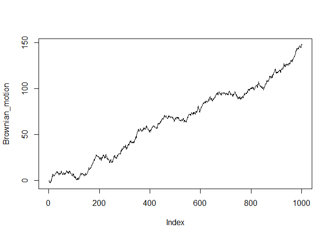

Geometric Brownian motion
-------------------------

The exponential version of a Brownian motion, a geometric Brownian motion, is widely used in modeling finanical asset price.

-   The following implements the simplified version of a geometric Brownian motion.

-   Consider it as a stock price movement starting at 1.

``` r
n <- 1000              # number of random walk
walk <- rnorm(n, mean = 0, sd = 0.01)     # generate normal random number
Brownian_motion <- c(0, cumsum(walk))   # cumulative sum of walk is random walk, starting at zero
GBM <- exp(Brownian_motion)
plot(GBM, type='l')
```

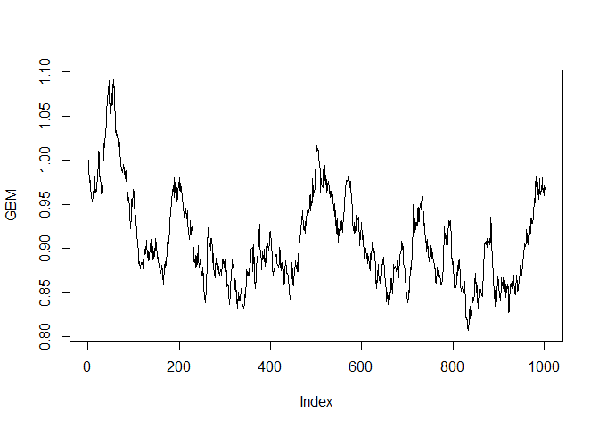
