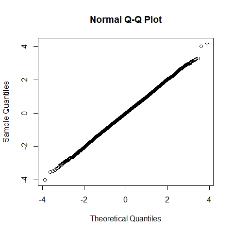
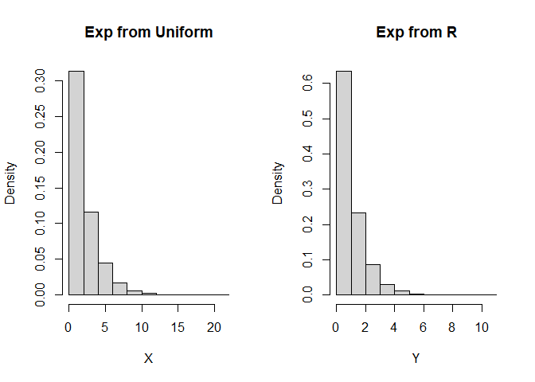
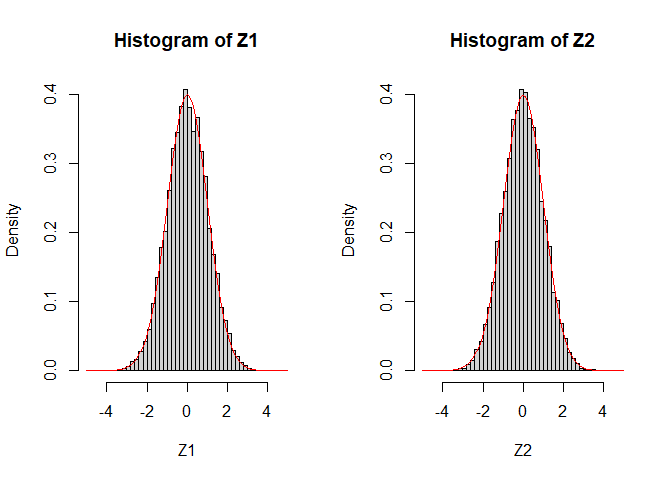
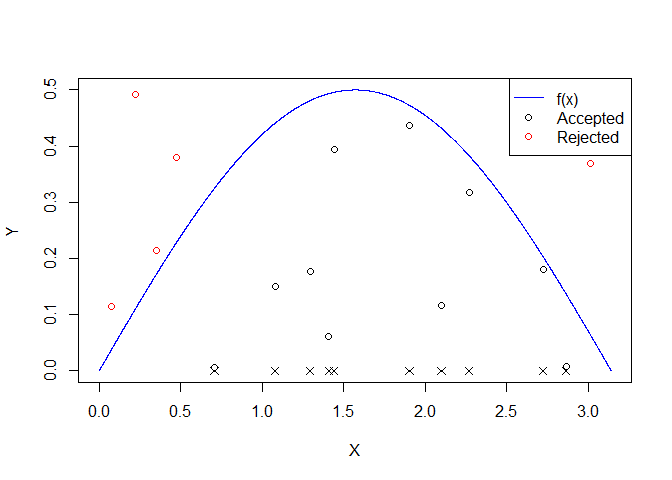
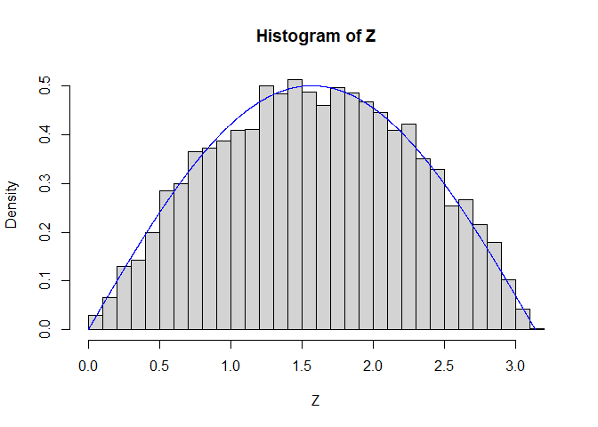
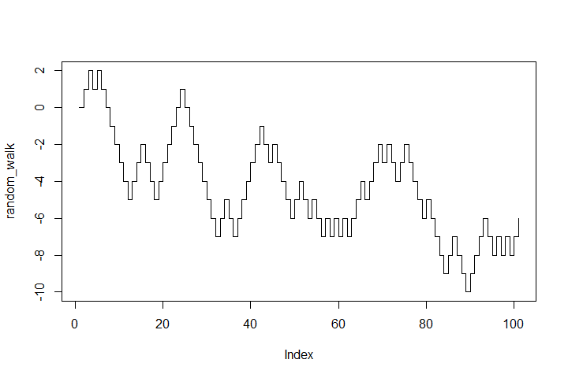
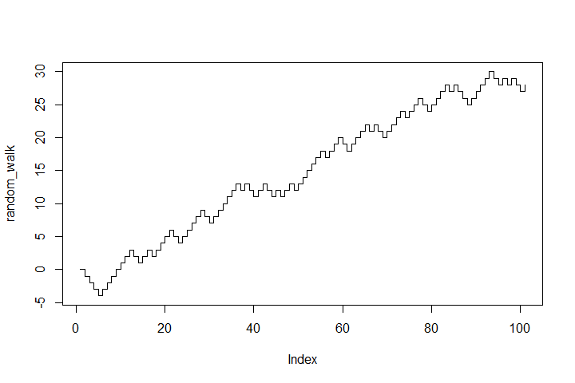
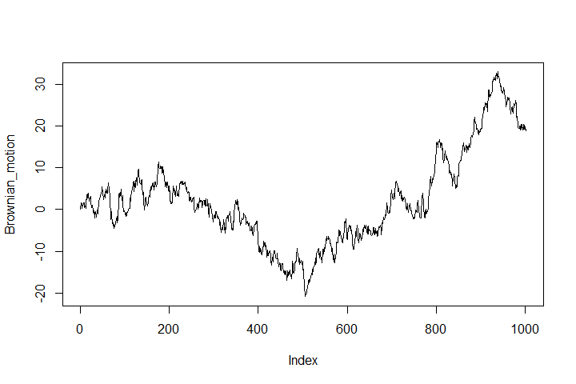
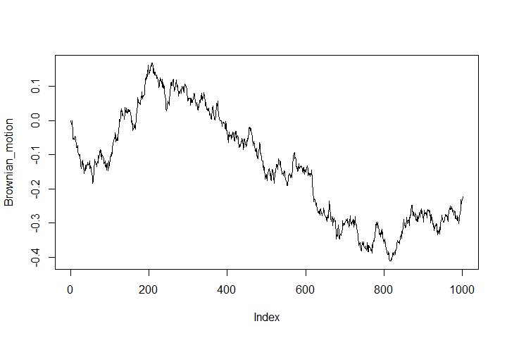

More on simulation
================

## Inversion method

### Generate normal distribution from uniform random variables

Using inverse normal cdf, we can simple generate a normal distribution
from uniform distribution.

-   In R, we use `qnorm` function.

-   This may not be efficient but easy to understand.

``` r
n <- 10000
my_norm_rv <- qnorm(runif(n))

# plot histogram and normal pdf
hist(my_norm_rv, breaks = seq(-5,5,0.2), freq=F)
x <- seq(-5,5,0.1)
lines(x, dnorm(x))
```

<!-- -->

QQ-plot

``` r
qqnorm(my_norm_rv)
```

<!-- -->

### Exponential distribution from uniform random variables

Recall this method, with `lambda = 0.5`.

``` r
lambda <- 0.5
Nsim <- 10000       #number of random variables
U <- runif(Nsim)
X <- - 1/lambda *log(U)        #transforms of uniforms
Y <- rexp(Nsim)     #exponential from R
par(mfrow=c(1,2))   #plots
hist(X, freq=FALSE, main="Exp from Uniform")
hist(Y, freq=FALSE, main="Exp from R")
```

<!-- -->

## Box-Muller algorithm to generate normal

Generate two normals from two uniforms.

In the following, `X1` and `X2` follows independent normal
distributions.

-   Note that `-2*log(U1)` follows the exponential distribution with
    *λ* = 2, i.e., the Chi-square distribution with d.f. = 2.

``` r
Nsim <- 10000
U1 <- runif(Nsim)   #uniform1
U2 <- runif(Nsim)   #uniform2
X1 <- sqrt(-2*log(U1))*cos(2*pi*U2)
X2 <- sqrt(-2*log(U1))*sin(2*pi*U2)

par(mfrow=c(1,2))
x <- seq(-5,5,0.1)
hist(X1, breaks = seq(-5,5,0.2), freq=F)
lines(x, dnorm(x), col='red')

hist(X2, breaks = seq(-5,5,0.2), freq=F)
lines(x, dnorm(x), col='red')
```

<!-- -->

## Rejection method

Suppose that pdf *f* is non-zero only on \[*a*, *b*\] and *f* &lt; *k*.

-   Generate *X* ∼ *U*(*a*, *b*) and *Y* ∼ *U*(0, *k*) independet of *X*

-   If *Y* &lt; *f*(*X*) then return *X*, otherwise go back to the
    previous step.

### Example

Suppose that pdf *f* is a sin  function.

*f*(*x*) = 0.5sin (*x*),  *x* ∈ \[0, *π*\]

``` r
NSim <- 10000
X <- runif(NSim, 0, pi)
Y <- runif(NSim)
Z <- X[0.5*sin(X) > Y ]
hist(Z, breaks = 40, freq=F)
x <- seq(0, pi, 0.001)
y <- 0.5*sin(x)
lines(x, y, col='red')
```

<!-- -->

## Random walk

### One-dimensional random walk

A basic example of a random walk is the random walk on the integer,
which start at 0 and at each step moves +1 or -1 with equal probability.

``` r
n <- 100              # number of random walk
walk <- rbinom(n, size = 1, prob = 0.5)     # generate bernoulli random number
walk[walk == 0] <- -1               # change 0 as -1
random_walk <- c(0, cumsum(walk))   # cumulative sum of walk is random walk, starting at zero
plot(random_walk, type='s')
```

<!-- -->

### Random walk with unequal probablity

Simpliy change `prob` in the above code.

``` r
n <- 100              # number of random walk
walk <- rbinom(n, size = 1, prob = 0.6)     # generate bernoulli random number
walk[walk == 0] <- -1               # change 0 as -1
random_walk <- c(0, cumsum(walk))   # cumulative sum of walk is random walk, starting at zero
plot(random_walk, type='s')         # upward random walk
```

<!-- -->

## Brownian motion

In the above example, each movement is simpy +1 or -1.

If the movement follows a normal distribution, the process is an
approximation of a Brownian motion.

``` r
n <- 1000              # number of random walk
walk <- rnorm(n, mean = 0, sd = 1)     # generate normal random number
Brownian_motion <- c(0, cumsum(walk))   # cumulative sum of walk is random walk, starting at zero
plot(Brownian_motion, type='l')
```

<!-- -->

You can modify the time index in the graph.

``` r
time_index <- seq(0,n*0.01,0.01)
plot(time_index, Brownian_motion, type='l')
```

<!-- -->

You can change the `mean` or `sd` of the normal distribution.

With `sd = 0.01`.

``` r
n <- 1000              # number of random walk
walk <- rnorm(n, mean = 0, sd = 0.01)     # generate normal random number
Brownian_motion <- c(0, cumsum(walk))   # cumulative sum of walk is random walk, starting at zero
plot(Brownian_motion, type='l')
```

<!-- -->

With `mean = 0.1`.

``` r
n <- 1000              # number of random walk
walk <- rnorm(n, mean = 0.1, sd = 1)     # generate normal random number
Brownian_motion <- c(0, cumsum(walk))   # cumulative sum of walk is random walk, starting at zero
plot(Brownian_motion, type='l')
```

<!-- -->

## Geometric Brownian motion

The exponential version of a Brownian motion, a geometric Brownian
motion, is widely used in modeling finanical asset price.

-   The following implements the simplified version of a geometric
    Brownian motion.

-   Consider it as a stock price movement starting at 1.

``` r
n <- 1000              # number of random walk
walk <- rnorm(n, mean = 0, sd = 0.01)     # generate normal random number
Brownian_motion <- c(0, cumsum(walk))   # cumulative sum of walk is random walk, starting at zero
GBM <- exp(Brownian_motion)
plot(GBM, type='l')
```

<!-- -->
